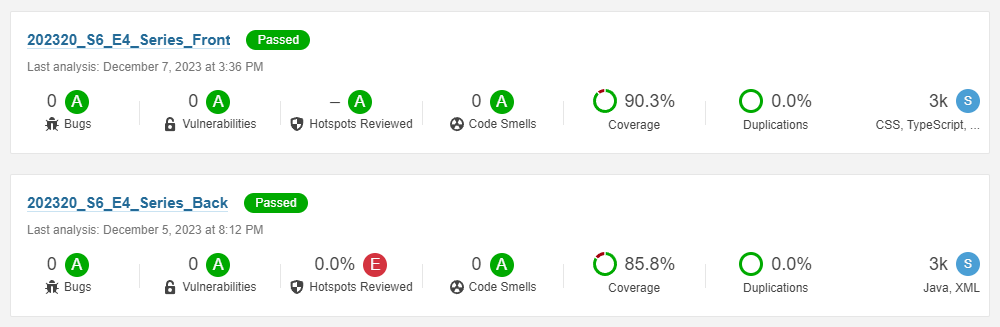

# Project-DSW-2023-20

This project was developed throughout the semester in the course *Software Development in Teams (ISIS-2603)* of Los Andes University, where we applied knowledge of front-end, back-end, and metrics to ensure the quality in development and teamwork.

## Project Description
The application allows users to retrieve information about series from various streaming platforms, providing details on episodes, actors, directors, categories, and platforms. It was recognized as the best application in the section, according to the students' votes.

## Technologies Used
- **Front-End:** Primarily developed using *Angular* and *Bootstrap*, along with related technologies.
- **Back-End:** Implemented in *Java* using *Spring with JPA*.

## Project Demo
Click on the image to see a demonstration of the application in Spanish.

## Testing
Both the back-end and front-end have extensive test coverage. Back-end tests are located in the "test" folder, while front-end tests are distributed in ".spec" files. Both repositories have more than 85% coverage according to *SonarQube*, as shown in the following image:

## Usage
To use the application, run the *MainApplication* file within the "back" repository. Then, copy the "poblacion.sql" file (also from the "back") into the console available [here](http://localhost:8080/api/h2-console/) (password: password). Finally, run the `ng serve` command in the "front" repository and deploy the corresponding hyperlink.

## Data Source
The data in the SQL file is primarily sourced from the [TVMaze](https://www.tvmaze.com/api) API, with additional information collected through online queries. No team member claims ownership of the series featured in the application. All work was conducted for educational purposes and without any profit motive.

## Participants
- **Sara Sofía Cárdenas Rodríguez - Project Leader**
  - GitHub: [sariswis](https://github.com/sariswis)

- **Daniel Felipe Diaz Moreno - Co-Leader and Technical Director**
  - GitHub: [ddi4z](https://github.com/ddi4z)

- **Juan Felipe Camelo**
  - GitHub: [jfCamelo](https://github.com/jfCamelo)

- **Juan Sebastián Sánchez**
  - GitHub: [JuanseSanchez](https://github.com/JuanseSanchez)

- **Sara Benavides Mora**
  - GitHub: [sarabemora](https://github.com/sarabemora)

- **Milton Mesa Manrique**
  - GitHub: [mamesam1](https://github.com/mamesam1)
