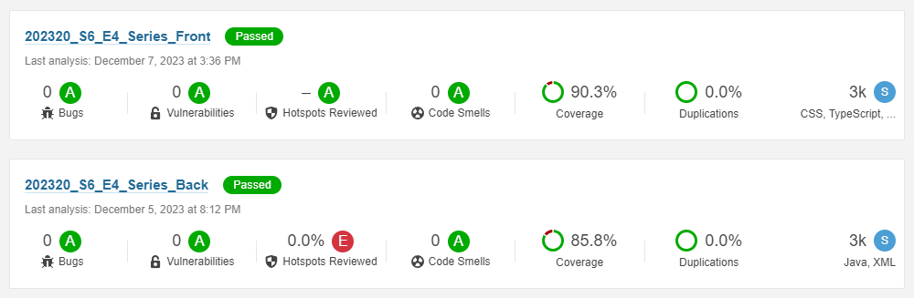

# Proyecto-DSW-2023-20

Este proyecto se desarrolló a lo largo del semestre en el curso *Desarrollo de Software en Equipo (ISIS-2603)*, donde aplicamos conocimientos de front-end, back-end y métricas para garantizar calidad en el desarrollo y trabajo en equipo.

## Descripción del Proyecto
La aplicación permite consultar información sobre series de distintas plataformas de streaming, con detalles sobre episodios, actores, directores, categorías y plataformas. Fue reconocida como la mejor aplicación en la sección, según la votación de los estudiantes.

## Tecnologías Utilizadas
- **Front-End:** Desarrollado principalmente con *Angular* y *Bootstrap*, junto con tecnologías relacionadas.
- **Back-End:** Implementado en *Java* utilizando *Spring con JPA*.

## Demostración del Proyecto
Haz clic en la imagen para ver una demostración de la aplicación en español.

## Pruebas
Ambos el back-end y el front-end cuentan con una amplia cobertura de pruebas. Las pruebas del back-end están en la carpeta "test", mientras que las del front-end están distribuidas en archivos ".spec". Ambos repositorios tienen más del 85% de cobertura según *SonarQube*, como se muestra en la siguiente imagen:

## Uso
Para utilizar la aplicación, ejecuta el archivo *MainApplication* dentro del repositorio "back". Luego, copia el archivo "poblacion.sql" (también del "back") en la consola disponible [aquí](http://localhost:8080/api/h2-console/). Finalmente, ejecuta el comando `ng serve` en el repositorio "front" y despliega el hipervínculo correspondiente.

## Participantes
- **Sara Sofía Cárdenas Rodríguez - Líder del Proyecto**
  - GitHub: [sariswis](https://github.com/sariswis)

- **Daniel Felipe Diaz Moreno - Co-Líder y Director Técnico**
  - GitHub: [ddi4z](https://github.com/ddi4z)

- **Juan Felipe Camelo**
  - GitHub: [jfCamelo](https://github.com/jfCamelo)

- **Juan Sebastian Sanchez**
  - GitHub: [JuanseSanchez](https://github.com/JuanseSanchez)

- **Sara Benavides Mora**
  - GitHub: [sarabemora](https://github.com/sarabemora)

- **Milton Mesa Manrique**
  - GitHub: [mamesam1](https://github.com/mamesam1)
